#### 练习2：使用qemu执行并调试lab1中的软件。（要求在报告中简要写出练习过程）

为了熟悉使用qemu和gdb进行的调试工作，我们进行如下的小练习：

1. 从CPU加电后执行的第一条指令开始，单步跟踪BIOS的执行。

2. 在初始化位置0x7c00设置实地址断点,测试断点正常。

3. 从0x7c00开始跟踪代码运行,将单步跟踪反汇编得到的代码与bootasm.S和 bootblock.asm进行比较。

4. 自己找一个bootloader或内核中的代码位置，设置断点并进行测试。

   

##### 1. 从CPU加电后执行的第一条指令开始，单步跟踪BIOS的执行

在Makefile中增加以下伪目标：

```shell
my-debug: $(UCOREIMG)
	$(V)$(QEMU) -S -s -parallel stdio -hda $< -serial null &
	$(V)sleep 2
	$(V)$(TERMINAL)  -e "gdb -tui -q -x tools/gdbinit"
```

其中tools/gdbinit文件内容为：

```
set architecture i8086
target remote :1234
```

my-debug对应如下两条shell命令：

```shell
qemu-system-i386 -S -s -parallel stdio -hda bin/ucore.img -serial null &
gnome-terminal -e "gdb -tui -q -x tools/gdbinit"
```

输入`make my-debug`命令进行调试

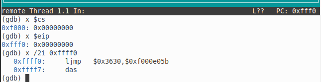

可以看到第一条指令的cs内容为0xf000，eip内容为0xfff0，此时cpu处于实模式，物理地址=cs * 16 + ip，即当前指令地址为0xffff0

0xffff0处的指令为`ljmp   $0x3630,$0xf000e05b` ，地址0xffff0为BIOS的入口地址，该地址的指令为跳转指令，跳转到0xf000:0xe05b处执行BIOS代码

正常在8086 16位模式下该处的指令为`ljmp $0xf000,$0xe05b` ，图上显示的可能是按照32位模式进行解释的，和预想不太一样

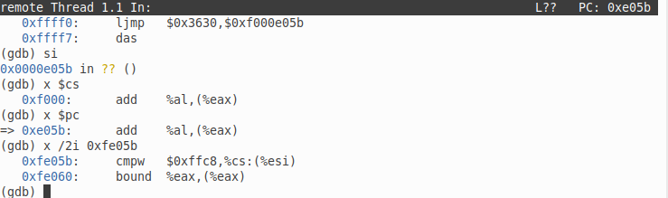

输入`si`后执行下一条指令，可见此时pc地址跳转到0xf000:0xe05b处，即0xfe05b，从此处开始执行BIOS代码，BIOS程序读取首扇区MBR上的bootloader代码放到0x7c00处，进而cpu控制权交给bootloader进行执行


##### 2. 在初始化位置0x7c00设置实地址断点,测试断点正常

输入`b *0x7c00`在0x7c00处打断点，输入`continue`运行到断点处

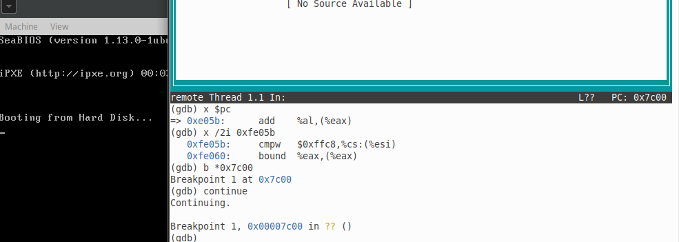


##### 3. 从0x7c00开始跟踪代码运行,将单步跟踪反汇编得到的代码与bootasm.S和 bootblock.asm进行比较

输入`x /5i 0x7c00`显示0x7c00地址开始的连续5条指令，可见于bootasm.S中的前五条指令是一致的

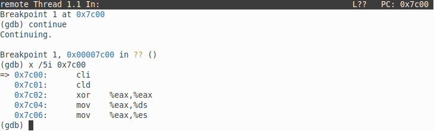

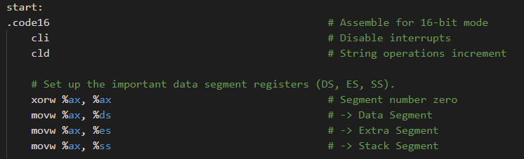


##### 4. 自己找一个bootloader或内核中的代码位置，设置断点并进行测试

以调试内核为例，这里配合VS Code进行调试，更加直观，方便操作

使用Ubuntu中的VS Code进行调试。VS Code需要做如下配置：

- 将lab1_result目录在VS Code中打开
- 点击运行-创建launch.json文件，选择gdb调试器
  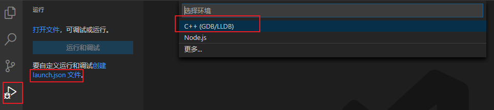]

- VS Code会自动创建该文件模板，在配置项中只需修改和增加下面两个
  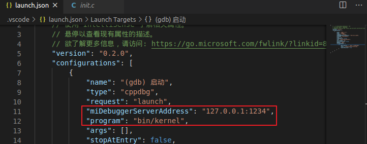]

```json
"miDebuggerServerAddress": "127.0.0.1:1234",
"program": "bin/kernel"
```

完成配置后可通过VS Code进行调试

- 使用`make gdb`使qemu进入调试模式
  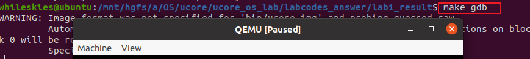]
  
- 在内核代码中添加断点
  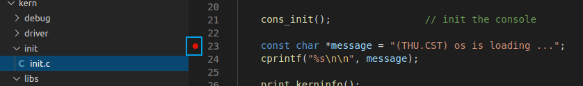]
  
- 启动调试
  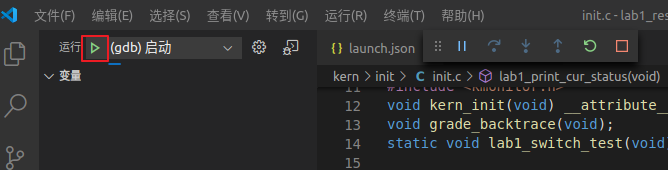]
  
- 进行调试
  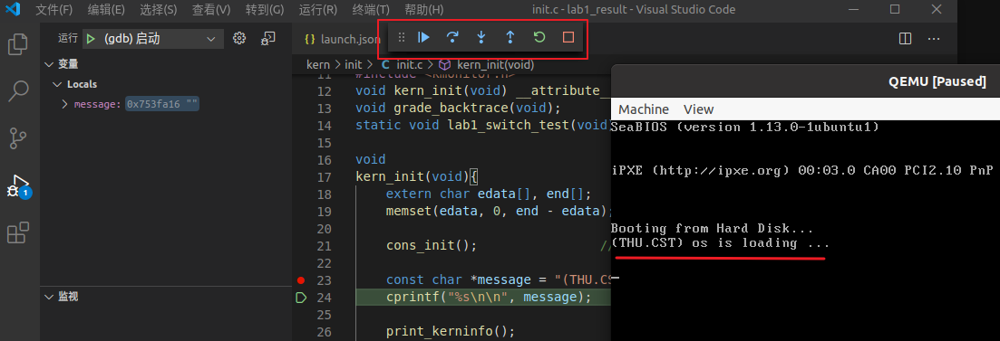]