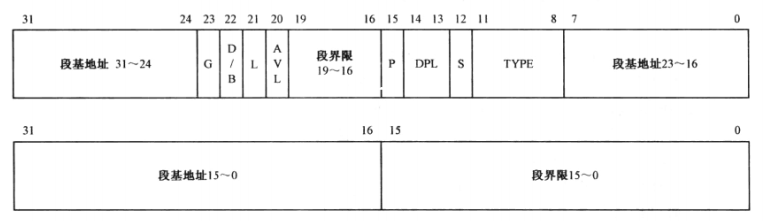
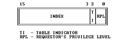
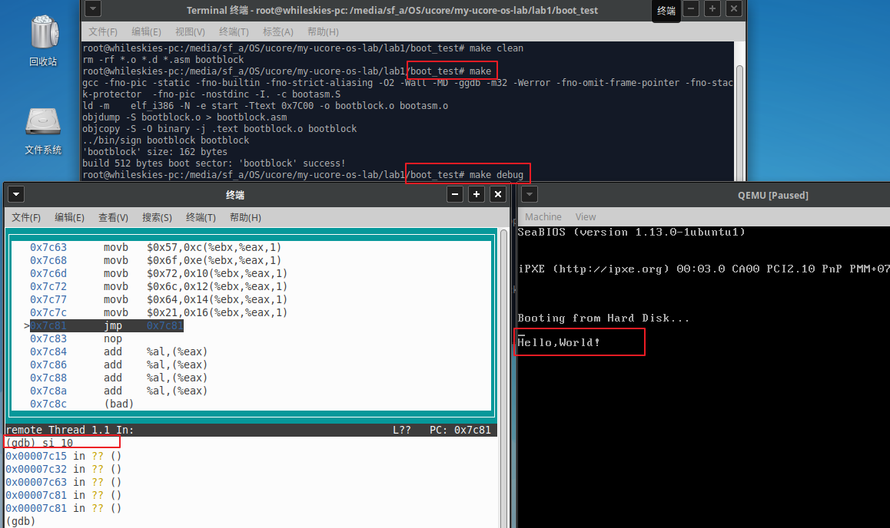

## 练习3：分析bootloader进入保护模式的过程。（要求在报告中写出分析）

BIOS将通过读取硬盘主引导扇区到内存，并转跳到对应内存中的位置执行bootloader。请分析bootloader是如何完成从实模式进入保护模式的。

提示：需要阅读**小节“保护模式和分段机制”**和lab1/boot/bootasm.S源码，了解如何从实模式切换到保护模式，需要了解：

- 为何开启A20，以及如何开启A20
- 如何初始化GDT表
- 如何使能和进入保护模式


### 实模式与保护模式

Intel 80386 cpu主要有两种运行模式：实模式和保护模式。

cpu刚启动时处于实模式，实模式主要为兼容之前的cpu，如8086，只有20根地址线，cpu位宽为16位。因为寄存器为16位，无法完整访问整个存储空间，因此实模式采用分段的方式访问物理内存。物理地址计算方法为：

> 物理地址 = 段寄存器值 * 16 + 偏移值

段寄存器如cs、ds、ss、es等，偏移值存储在通用寄存器中，通过两个寄存器按照上述方法来直接访问物理内存。程序可直接访问物理内存，并无保护功能。

同时，因为只有20根地址线，只能访问1M的物理内存空间，但是通过实模式的segment:offset寻址方式最大地址为0xffff << 4 + 0xffff = 0x10ffef，超出了20根地址线，在8086中会发生地址回卷，最高的第20位被丢掉（从0开始），实际物理内存地址为0x0ffef。随后的处理器，如80286、80386都拥有更多的地址线，为使得其在实模式下与8086表现保持一致，实模式下使得第20根地址线恒为0，发生回卷时，则物理地址不会超出1M的内存空间。因此80386提供了方式用于是否打开A20地址线，若cpu进入保护模式需打开A20。

80386保护模式下可以使用32位地址线，访问4GB的物理内存空间。保护模式下程序访问内存使用分段存储管理机制，内存可被划分为若干段，每一段拥有基址、界限、特权级、权限等属性，程序在访问段时可进行安全检查，保证安全，因此叫做保护模式，突出对内存保护的安全特性。

内存被分为多个段，如代码段、数据段、堆、栈等，每一段的属性为段描述符，多个段描述符组成段描述符表。段描述符表存储在物理内存中，30386中拥有段描述符表寄存器（GDTR、LDTR），用于存储段描述符表的基址和界限。描述符表分为全局段描述符表（GDT）与本地段描述符表（LDT），OS使用的为GDT与GDTR。

段描述符格式如下所示，共占8个字节：



GDTR全局描述符寄存器格式如下所示，分为32位基址与16位界限：


内存地址的概念有多种，如逻辑地址、线性地址、物理地址。

逻辑地址即程序中看到和使用的地址，由段选择器和偏移组成（*segment:offset*），此时段寄存器不再作为段地址了，而是段描述符表中的索引，用于选择一个段，从该段的描述符中得到段基址，与偏移值相加，得到线性地址。分段地址转换过程如下所示：


若再增加分页机制，线性地址经过转换后成为物理地址。若无分页机制，线性地址即为物理地址。

在ucore中，内存管理主要使用分页管理机制，而很少依赖分段管理机制。在配置段表时，不对逻辑地址做任何改变，也即逻辑地址=线性地址。bootloader中由于没有分页机制，因此逻辑地址=线性地址=物理地址。


### BootLoader编写

为学习bootloader将cpu从实模式切换为保护模式的过程，根据bootasm.S代码编写了测试的bootloader，完成实模式到保护模式的过程，并且可以向显示器输出hello world等信息。相关代码位于`boot_test`文件夹。

### 初始化

```asm
.global start
start:
.code16     # 16位实模式
    cli     # 关闭中断
    cld     # 字符串操作时方向递增

    xorw %ax, %ax       # 通过异或操作，设置ax寄存器值为0
    # 设置ds, es, ss寄存器为0
    movw %ax, %ds      
    movw %ax, %es
    movw %ax, %ss 
```

bootloader入口地址为start，此时处于实模式。首先需要关闭中断，避免产生中断被BIOS中断处理程序处理。之后将各个段基址设为0。

### 开启A20

```assembly
# 打开A20地址线
inb $0x92, %al      # 通过0x92端口打开A20
orb $0x2, %al
outb %al, $0x92
```

A20线可由多种方式启动，这里通过向位于0x92端口的Fast Gate A20的第1位置1来开启A20。

### 初始化GDT表

```c
#define SEG_NULLASM                                             \
    .word 0, 0;                                                 \
    .byte 0, 0, 0, 0

#define SEG_ASM(type,base,lim)                                  \
    .word (((lim) >> 12) & 0xffff), ((base) & 0xffff);          \
    .byte (((base) >> 16) & 0xff), (0x90 | (type)),             \
        (0xC0 | (((lim) >> 28) & 0xf)), (((base) >> 24) & 0xff)


/* Application segment type bits */
#define STA_X       0x8     // Executable segment
#define STA_E       0x4     // Expand down (non-executable segments)
#define STA_C       0x4     // Conforming code segment (executable only)
#define STA_W       0x2     // Writeable (non-executable segments)
#define STA_R       0x2     // Readable (executable segments)
#define STA_A       0x1     // Accessed
```

asm.h文件通过宏的方式来定义了初始化段描述符的宏函数。该函数中，段描述符的G=1，段界限已4K为单位，但参数lim以字节为单位，因此在段界限分片时均右移12位（除以4K）。

.word分别定义了段界限15~0、段基址15~0

.byte分别定义了如下四部分：

1. 段基址23~16

2. P=1、DPL=00、S=1、TYPE=type

3. G=1、D/B=1、L=0、AVL=0、段界限19~16

4. 段基址31~24

   

```asm
# 设置GDT表
    lgdt gdtdesc        # 将gdt信息写入GDTR（包括基址与界限）

# bootloader的GDT表
.p2align 2      # 强制4字节对齐
gdt:
    SEG_NULLASM     # 第一个段为空段
    SEG_ASM(STA_X | STA_R, 0x0, 0xffffffff)     # 代码段
    SEG_ASM(STA_W, 0x0, 0xffffffff)     # 数据段


gdtdesc:
    .word 0x17      # GDT边界，三个段，共3 * 8 = 24 B，值为24 - 1 = 23 (0x17)
    .long gdt       # GTD基址，长度32
```

初始化GDT时，创建了3个段，第一个为空段，第二为代码段，第三个为数据段，代码段和数据段基址均为0，总长度都为整个内存空间4G大小，因此逻辑地址=线性地址。

通过lgdt指令来将GDT信息写入GDTR。

### 进入保护模式

```assembly
.set PROT_MODE_CSEG, 0x8        # 代码段选择子  0000 1 000
.set PROT_MODE_DSEG, 0x10       # 数据段选择子  0001 0 000 
.set CR0_PE_ON, 0x1             # 保护模式打开标志

	# 切换为保护模式
    movl %cr0, %eax
    orl $CR0_PE_ON, %eax
    movl %eax, %cr0 

    ljmp $PROT_MODE_CSEG, $protcseg 

.code32
protcseg:
    # 设置段寄存器选择子为GDT表中的数据段
    movw $PROT_MODE_DSEG, %ax
    movw %ax, %ds 
    movw %ax, %es
    movw %ax, %fs
    movw %ax, %gs 
    movw %ax, %ss

    # 设置堆栈，从0开始到0x7c00（bootloader起始地址）
    movl $0x0, %ebp
    movl $start, %esp
```

通过将cr0寄存器的第0位（PE位：保护模式允许位）置1，cpu进入保护模式。通过ljmp指令跳转到32位代码开始执行，同时更新了代码段的选择子为0x8，以及清空了流水线过时的16位代码。

段选择子的结构如下所示：



在cpu段机制通过选择子查找GDT时，将会自动将index * 8 作为GDT的索引（字节为单位），因此位于第二个段的代码段选择子应为0x8，低3位为RPL。

进入保护模式后，将各个段寄存器设置为新的选择子，并设置堆栈指针从0x7c00出向下增长，用来后续执行C语言的函数。

### 输出Hello World！

```assembly
print:
    # 向显卡输出字符
    movl $0xb8000, %eax
    movl $0x5a0, %ebx
    movb $'H', 0x0(%ebx, %eax)
    movb $'e', 0x2(%ebx, %eax)
    movb $'l', 0x4(%ebx, %eax)
    movb $'l', 0x6(%ebx, %eax)
    movb $'o', 0x8(%ebx, %eax)
    movb $',', 0xa(%ebx, %eax)
    movb $'W', 0xc(%ebx, %eax)
    movb $'o', 0xe(%ebx, %eax)
    movb $'r', 0x10(%ebx, %eax)
    movb $'l', 0x12(%ebx, %eax)
    movb $'d', 0x14(%ebx, %eax)
    movb $'!', 0x16(%ebx, %eax)

spin:
    jmp spin
```

0xB8000~0xBFFFF是显卡的地址空间，上段代码向该地址空间依次输出`Hello World！`。

在 AT&T 汇编格式中，内存操作数的寻址方式是：

> section:disp(base, index, scale)

段基址为0，因此计算出的线性地址为：disp + base + index * scale

### 运行结果



可见qemu中输出了Hello World！


### 参考

- [x86汇编语言：从实模式到保护模式](http://item.jd.com/11179005.html) 李忠，王晓波，余洁 著，电子工业出版社，2013
- [xv6 book 中文文档](https://www.gitbook.com/book/th0ar/xv6-chinese/details)
- [ucore文档](https://chyyuu.gitbooks.io/ucore_os_docs/content/lab1/lab1_3_2_1_protection_mode.html)

