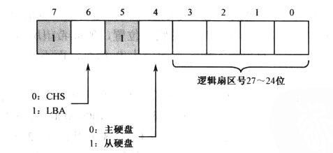
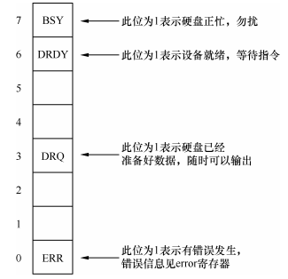
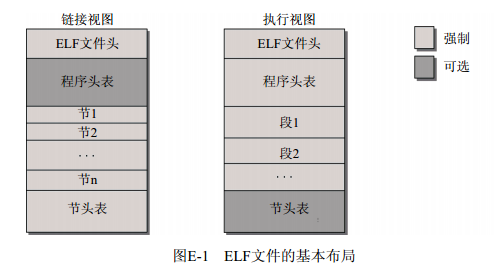
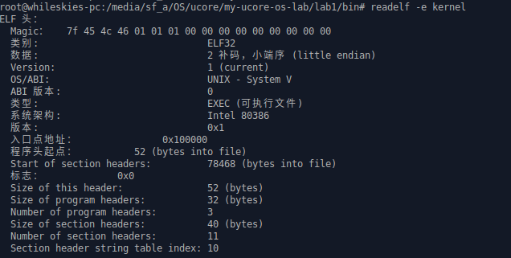
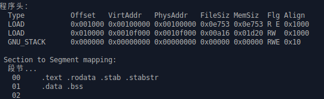

## 练习4：分析bootloader加载ELF格式的OS的过程。（要求在报告中写出分析）

通过阅读bootmain.c，了解bootloader如何加载ELF文件。通过分析源代码和通过qemu来运行并调试bootloader&OS。

- bootloader如何读取硬盘扇区的？
- bootloader是如何加载ELF格式的OS？

### bootloader如何读取硬盘扇区的？

#### 内联汇编函数

bootloader以及OS在执行时需要直接使用一些汇编指令，如常用的IO指令，采用内联汇编的方式将常用的汇编操作封装为函数，有利于复用，头文件`x86.h`为一些常用的内联汇编函数封装。

如下面两个函数：

```C
static inline uint8_t
inb(uint16_t port) {
    uint8_t data;
    asm volatile ("inb %1, %0" : "=a" (data) : "d" (port));
    return data;
}
```

inb函数作用为从port IO端口读取一字节数据作为该函数的返回值，data变量为输出，使用al寄存器，占位符为%0，port变量为输入，使用dx寄存器，占位符为%1。

```C
static inline void
insl(uint32_t port, void *addr, int cnt) {
    asm volatile (
            "cld;"
            "repne; insl;"
            : "=D" (addr), "=c" (cnt)
            : "d" (port), "0" (addr), "1" (cnt)
            : "memory", "cc");
}
```

insl函数作用为从port IO端口读取cnt个双字(4Byte)大小的数据到基址为addr的内存中。

输出变量：addr使用edi，cnt使用ecx；

输入变量：port使用edx，addr使用edi（0代表输出输入变量的第0个），cnt使用ecx；

约束：执行过程中内存会发生改变，状态寄存器会改变。

cld为清除方向状态寄存器，即设置df  = 0，edi移动方向为内存递增，

repne代表重复下一字符串操作指令若干次，直到ecx = 0或ZF= 1，也即重复insl指令cnt次（ecx值），

insl为从端口edx中输入双字到es:edi所指的内存中，也即addr处。

#### 磁盘访问

磁盘的读取方式主要有两种CHS(Cylinder Head Sector)、LBA(Logical Block Address)，CHS通过柱面-磁头-扇区三个值进行定位，较为麻烦；LBA方式进一步屏蔽了细节，将磁盘按照扇区号进行统一编址，访问时给出扇区号即可。LBA有LBA28和LBA48两种，分别表示扇区地址为28位和48位。

第一个IDE通道通过IO地址0x1f0-0x1f7访问，通过0x1f6端口可以设置主从盘、访问方式以及扇区号27—24位，如下图所示：



磁盘IO地址与相应功能如下表：

| IO地址 | 功能                                                         |
| ------ | ------------------------------------------------------------ |
| 0x1f0  | 读数据，当0x1f7不为忙状态时，可以读。                        |
| 0x1f2  | 要读写的扇区数，每次读写前，你需要表明你要读写几个扇区。最小是1个扇区 |
| 0x1f3  | 如果是LBA模式，就是LBA参数的0-7位                            |
| 0x1f4  | 如果是LBA模式，就是LBA参数的8-15位                           |
| 0x1f5  | 如果是LBA模式，就是LBA参数的16-23位                          |
| 0x1f6  | 第0~3位：如果是LBA模式就是24-27位 第4位：为0主盘；为1从盘    |
| 0x1f7  | 状态和命令寄存器。操作时先给命令，再读取，如果不是忙状态就从0x1f0端口读数据 |

```C
#define SECTSIZE        512

/* waitdisk - 等待磁盘准备就绪 */
static void
waitdisk(void) {
    while ((inb(0x1F7) & 0xC0) != 0x40)
        /* 死循环等待 */;
}
```

读取0x1f7端口来获取磁盘控制器状态，若第7位为1，表示磁盘正忙，需要等待，若第7位为0，第6位为1，表示准备就绪。



```C
/* readsect - read a single sector at @secno into @dst */
/* 读取编号为secno的一个扇区到dst地址处 */
static void
readsect(void *dst, uint32_t secno) {
    // 等待磁盘准备就绪
    waitdisk();

    outb(0x1F2, 1);                         // count = 1  读取一个扇区
    outb(0x1F3, secno & 0xFF);
    outb(0x1F4, (secno >> 8) & 0xFF);
    outb(0x1F5, (secno >> 16) & 0xFF);
    outb(0x1F6, ((secno >> 24) & 0xF) | 0xE0);
    outb(0x1F7, 0x20);                      // 0x20为读取磁盘命令

    // 等待磁盘准备就绪
    waitdisk();

    // 读该扇区
    insl(0x1F0, dst, SECTSIZE / 4);  //insl每次读取4B，cnt为 扇区长度 / 4
}
```

```C
/* *
 * readseg - read @count bytes at @offset from kernel into virtual address @va,
 * might copy more than asked.
 * 从内核的offset偏移处读取count个字节到虚拟地址va中，可能复制的字节数多于请求的count个
 * */
static void
readseg(uintptr_t va, uint32_t count, uint32_t offset) {
    uintptr_t end_va = va + count;  //读取地址尾部

    // 向下对准到磁盘边界
    va -= offset % SECTSIZE;

    // 将偏移量转为扇区号，内核始于扇区1
    uint32_t secno = (offset / SECTSIZE) + 1;

    // If this is too slow, we could read lots of sectors at a time.
    // We'd write more to memory than asked, but it doesn't matter --
    // we load in increasing order.
    for (; va < end_va; va += SECTSIZE, secno ++) {
        readsect((void *)va, secno);  //依次读取若干扇区
    }
}
```

因为readsect函数每次只完整读取一个扇区，考虑到readseg的偏移读取，通过`va -= offset % SECTSIZE`来向下对准到磁盘边界，因此如果读取磁盘中内核文件的起始数据不位于一个扇区的开始，应将va减小，使得完整读取一个扇区后，原va处正好就是内核文件经过偏移offset后的起始数据。

### bootloader是如何加载ELF格式的OS？

ELF(Executable and linking format)文件格式是Linux系统下一种常用的目标文件(object file)格式，主要有可执行文件、重定向文件、共享目标文件三种类型。

ELF链接文件和可执行文件基本布局如下图所示：



此实验编译出的内核文件为ELF格式的可执行文件，主要有ELF文件头、程序头表、以及相应段组成。

ELF文件头用于描述该ELF文件的元信息，其结构体如下所示：

```C 
#define ELF_MAGIC    0x464C457FU            // "\x7FELF" in little endian  ELF魔数，小端存储

/* ELF文件头 */
struct elfhdr {
    uint32_t e_magic;     // ELF魔数，7f 45 4c 46
    uint8_t e_elf[12];    // ELF格式信息，32/64位，大端/小端存储
    uint16_t e_type;      // 1=relocatable, 2=executable, 3=shared object, 4=core image
    uint16_t e_machine;   // ELF体系结构类型，3=x86, 4=68K, etc.
    uint32_t e_version;   // 文件版本，总为1
    uint32_t e_entry;     // 可执行程序入口虚拟地址
    uint32_t e_phoff;     // 程序头表在文件内的字节偏移量
    uint32_t e_shoff;     // 节头表在文件内的字节偏移量
    uint32_t e_flags;     // 处理器相关标识，通常为0
    uint16_t e_ehsize;    // ELF header文件头字节大小
    uint16_t e_phentsize; // 程序头表每个条目(entry)的字节大小
    uint16_t e_phnum;     // 程序头表条目数量，即段的个数
    uint16_t e_shentsize; // 节头表每个条目(entry)的字节大小
    uint16_t e_shnum;     // 节头表中条目的数量，即节的个数
    uint16_t e_shstrndx;  // string name table在节头表中的索引index
};
```

程序头表用来描述程序中的各段信息，如代码段、数据段等，这些段组成了最终在内存中执行的程序。程序头表提供了各段在虚拟地址空间和物理地址空间中的大小、位置、标志、访问授权和对齐方面的信息。程序头表结构如下所示：

```C
struct proghdr {
    uint32_t p_type;   // 段类型， 如可加载的代码段或数据段、动态链接信息段等
    uint32_t p_offset; // 本段在文件内的其实偏移
    uint32_t p_va;     // 本段在内存中的起始虚拟地址
    uint32_t p_pa;     // 本段在内存中的起始物理地址，不使用
    uint32_t p_filesz; // 本段在文件中的大小
    uint32_t p_memsz;  // 本段在内存中的大小（如果包含bss节，会更大）
    uint32_t p_flags;  // 本段相关的标志，如读/写/执行
    uint32_t p_align;  // 对齐，和硬件页大小一致；如果为0或1，表示不需要对齐。否则，p_align应该是2的正整数幂，p_va和p_offset在对p_align取模后应相等
};
```

通过`readelf -e kernel`可获取kernel ELF文件的相关信息，ELF头信息如下所示：



可见程序入口虚拟地址为0x100000，程序头表偏移为52B，程序头表条目为3。

程序头表信息如下所示：



共有3个段，实际为前两个，最后一个是空段，第一个段是代码段，第二个段是数据段。

加载ELF格式的OS代码如下所示：

```C
#define ELFHDR          ((struct elfhdr *)0x10000)      // 暂存空间

void
bootmain(void) {
    // 从硬盘读取一页大小数据（4K）到内存0x10000地址处
    readseg((uintptr_t)ELFHDR, SECTSIZE * 8, 0);

    // 通过ELF魔数检查是否为合法的ELF文件
    if (ELFHDR->e_magic != ELF_MAGIC) {
        goto bad;
    }

    struct proghdr *ph, *eph;

    // 加载每个程序头到内存中（忽略程序头的flags）
    ph = (struct proghdr *)((uintptr_t)ELFHDR + ELFHDR->e_phoff);  //程序头表首项指针
    eph = ph + ELFHDR->e_phnum;  //程序头表尾指针，eph = ph + 3 * sizeof(struct proghdr)
    for (; ph < eph; ph ++) {
        // 依次将各个段加载到虚拟内存（此时虚拟内存 = 物理内存），内存地址固定在0x000000—0xFFFFFF之间
        readseg(ph->p_va & 0xFFFFFF, ph->p_memsz, ph->p_offset);
    }

    // 跳转到程序入口处执行，即0x100000处，(void (*)(void))addr为将addr(ELFHDR->e_entry &  
    // 0xFFFFFF)转换为无参数无返回值的函数指针，再调用函数指针执行该地址处的代码
    ((void (*)(void))(ELFHDR->e_entry & 0xFFFFFF))();

bad:
    //内核文件不是ELF文件，死循环
    outw(0x8A00, 0x8A00);
    outw(0x8A00, 0x8E00);

    /* do nothing */
    while (1);
}
```

### 参考

- 操作系统真相还原

- [ELF文件格式分析](https://wenku.baidu.com/view/90f39949e518964bcf847c13.html)

- [核中汇编写的字符串函数代码分析](https://www.cnblogs.com/taek/archive/2012/02/05/2338939.html)

- [Intel 80386 Programmer's Reference Manual](http://www.logix.cz/michal/doc/i386/)

- [GCC-Inline-Assembly-HOWTO](http://www.ibiblio.org/gferg/ldp/GCC-Inline-Assembly-HOWTO.html)

  