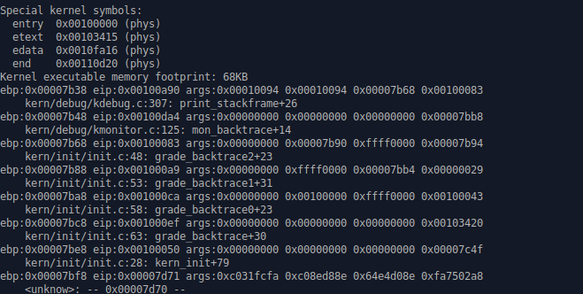
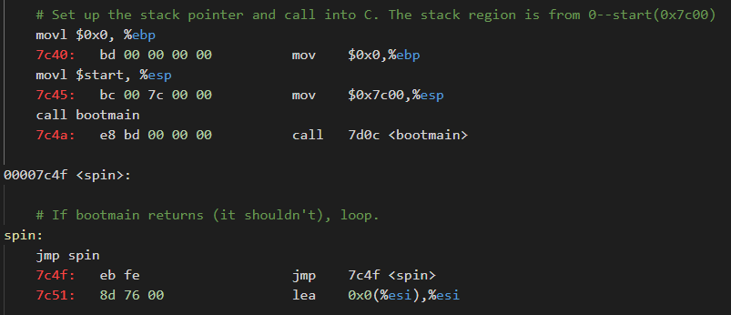
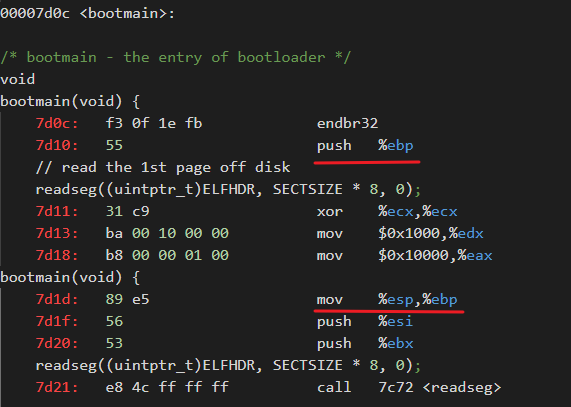
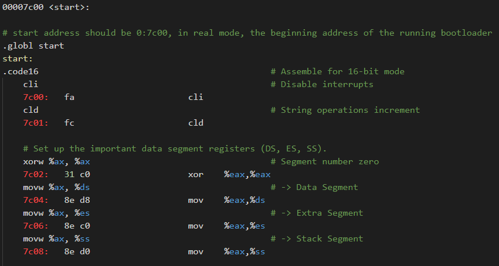
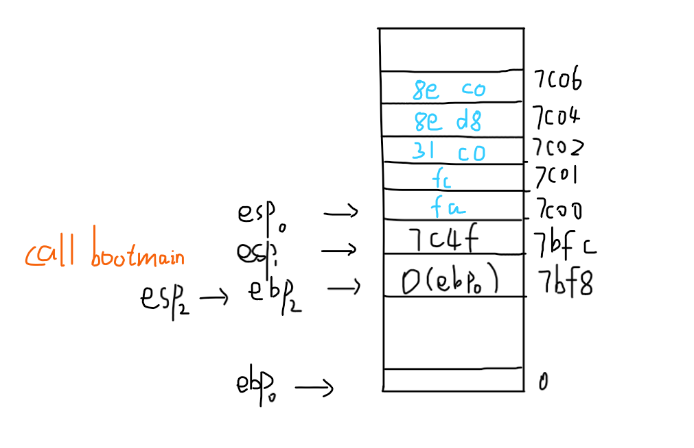

## 练习5：实现函数调用堆栈跟踪函数 （需要编程）

我们需要在lab1中完成kdebug.c中函数print_stackframe的实现，可以通过函数print_stackframe来跟踪函数调用堆栈中记录的返回地址。在如果能够正确实现此函数，可在lab1中执行 “make qemu”后，在qemu模拟器中得到类似如下的输出：

```
……
ebp:0x00007b28 eip:0x00100992 args:0x00010094 0x00010094 0x00007b58 0x00100096
    kern/debug/kdebug.c:305: print_stackframe+22
ebp:0x00007b38 eip:0x00100c79 args:0x00000000 0x00000000 0x00000000 0x00007ba8
    kern/debug/kmonitor.c:125: mon_backtrace+10
ebp:0x00007b58 eip:0x00100096 args:0x00000000 0x00007b80 0xffff0000 0x00007b84
    kern/init/init.c:48: grade_backtrace2+33
ebp:0x00007b78 eip:0x001000bf args:0x00000000 0xffff0000 0x00007ba4 0x00000029
    kern/init/init.c:53: grade_backtrace1+38
ebp:0x00007b98 eip:0x001000dd args:0x00000000 0x00100000 0xffff0000 0x0000001d
    kern/init/init.c:58: grade_backtrace0+23
ebp:0x00007bb8 eip:0x00100102 args:0x0010353c 0x00103520 0x00001308 0x00000000
    kern/init/init.c:63: grade_backtrace+34
ebp:0x00007be8 eip:0x00100059 args:0x00000000 0x00000000 0x00000000 0x00007c53
    kern/init/init.c:28: kern_init+88
ebp:0x00007bf8 eip:0x00007d73 args:0xc031fcfa 0xc08ed88e 0x64e4d08e 0xfa7502a8
<unknow>: -- 0x00007d72 –
……
```

请完成实验，看看输出是否与上述显示大致一致，并解释最后一行各个数值的含义。

### 函数堆栈

堆栈是函数运行时的内存空间，由高地址向低地址增长，ebp寄存器存储栈底地址，esp寄存器存储栈顶地址，始终指向栈顶元素；栈从高地址向地址增长。

- 入栈指令：push S，相当于R[%esp] = R[%esp] - 4;  M[R[%esp]] = S
- 出栈指令：pop D，相当于D = M[R[%esp]]; R[%esp] = R[%esp] + 4

函数调用时主要经过以下步骤：

- 调用者：
  - 将被调用函数的参数从右向左依次入栈
  - 执行call命令，将call命令的下一条指令地址，也即返回地址，压栈，同时跳转到被调用函数执行
- 被调用函数：
  - pushl %ebp：将调用者的栈底地址入栈，便于返回到调用者继续执行
  - movl %esp, %ebp：%ebp指向当前栈顶，也即与%esp指向相同，此函数的堆栈就此建立
  - 函数执行，临时变量压入堆栈
  - movl %ebp, %esp：%esp指向该函数的栈底
  - popl %ebp：将%ebp栈底指针重新指向调用者函数的栈底地址
  - ret：被调用函数从栈顶弹出返回地址，返回到调用函数继续执行

堆栈示意图如下所示：

```
+|  栈底方向     | 高位地址
 |    ...      |
 |    ...      |
 |  参数3       |
 |  参数2       |
 |  参数1       |
 |  返回地址     |
 |  上一层[ebp]  | <-------- [ebp]
 |  局部变量     |  低位地址
```

### 输出堆栈信息

输出调用堆栈的代码如下：

```C
void
print_stackframe(void) {
    uint32_t ebp = read_ebp();
    uint32_t eip = read_eip();
    
    for (int i = 0; i < STACKFRAME_DEPTH; i++) {
        if (ebp == 0) break;
    
        cprintf("ebp:0x%08x eip:0x%08x ", ebp, eip);

        cprintf("args:0x%08x 0x%08x 0x%08x 0x%08x", *(uint32_t *)(ebp + 8), 
                *(uint32_t *)(ebp + 12), *(uint32_t *)(ebp + 16), *(uint32_t *)(ebp + 20));
    
        cprintf("\n");

        print_debuginfo(eip - 1);
   
        eip = *(uint32_t *)(ebp + 4);
        ebp = *(uint32_t *)(ebp);
        // eip = ((uint32_t *)ebp)[1];
        // ebp = ((uint32_t *)ebp)[0];
    }

}
```

首先通过函数读取ebp、eip寄存器值，分别表示指向栈底的地址、当前指令的地址；

ss:[ebp + 8]为函数第一个参数地址，ss:[ebp + 12]为第二个参数地址；

ss:[ebp]处为上一级函数的ebp地址，ss:[ebp+4]为返回地址；

可通过指针索引的方式访问指针所指内容。

获取当前的eip值较为巧妙，代码如下：

```C
static __noinline uint32_t
read_eip(void) {
    uint32_t eip;
    asm volatile("movl 4(%%ebp), %0" : "=r" (eip));
    return eip;
}
```

在调用该函数时会创建相应堆栈，通过创建函数时压入的上一级函数返回地址来间接得到当前的eip。

### 运行结果



可见与上面的示例输出基本一致，显示了当前堆栈的调用信息。

### 结果分析

从kern_init函数到print_stackframe函数都是kernel函数的调用，kern_init的上一级是bootloader中的bootmain。

查看编译生成的bootloader与kernel汇编代码：



上图是bootloader开启保护模式后，初始化堆栈，跳转到7d0c处的bootmain进行执行；

可见运行bootmain C代码之前，初始化栈底为0，栈顶为0x7c00，0x7c00也是bootloader加载到内存的起始地址，也即堆栈为0x0000 - 0x7c00之间的部分，从0x7c00向下增长；

call bootmain，开始调用bootmain的代码，同时将返回地址(0x7c4f)压入堆栈，%esp变为0x7bfc；



调用bootmain后，先将原%ebp压栈，也即值0压栈，之后执行mov %esp, %ebp，将%ebp指向栈顶，也即0xf8处；

对于bootmain函数来说，是无参数的，因此按照ss:[ebp + 8]方式获取的并不是bootmain函数的第一个参数，而是指向了0x7c00的地方，在内存中是bootloader的代码区域，也即获取的是bootloader的起始代码，如下所示：



ss:[ebp + 8] 是 0x7c00处的值，从0x7c00开始读取4个字节为0xc031fcfa，符合结果输出；

以上过程的示意图如下所示：



### 参考

- [ucore文档-函数堆栈](https://chyyuu.gitbooks.io/ucore_os_docs/content/lab1/lab1_3_3_1_function_stack.html)

- [stabs文档](https://www.sourceware.org/gdb/onlinedocs/stabs.html)